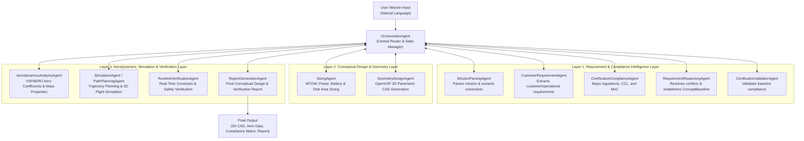
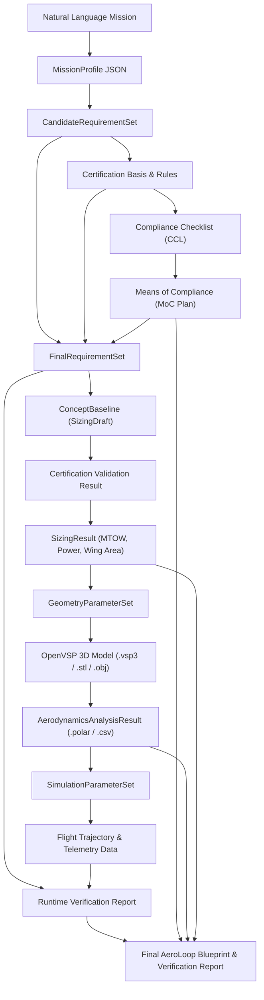

# AeroLoop: Autonomous Multi-Agent eVTOL / UAM Aircraft Conceptual Design & Verification Platform

<p align="center">
  <b>English</b> | <a href="README_KOR.md">한국어</a>
</p>

<p align="center">
  
</p>

**AeroLoop** is an engineering multi-agent platform designed to automate and orchestrate the full lifecycle of Urban Air Mobility (UAM) and eVTOL conceptual aircraft design, regulatory certification compliance, physics-based analysis, 3D parametric CAD modeling (OpenVSP), flight simulation, and runtime requirement verification.

Starting from **Natural Language Mission Inputs**, AeroLoop orchestrates requirement engineering $\rightarrow$ regulatory basis selection (EASA SC-VTOL, FAA, KAS) $\rightarrow$ compliance checklist (CCL) & means of compliance (MoC) mapping $\rightarrow$ vehicle sizing $\rightarrow$ 3D parametric CAD generation $\rightarrow$ aerodynamics & mass properties analysis (VSPAERO) $\rightarrow$ 3D flight trajectory simulation $\rightarrow$ runtime safety & requirement verification $\rightarrow$ automated report generation using a **Bidirectional LangGraph StateGraph** architecture.

---

## 📑 Table of Contents

1. [Key Features](#-key-features)
2. [System Architecture](#-system-architecture)
   - [3-Layer Multi-Agent Architecture](#1-3-layer-multi-agent-architecture)
   - [Bidirectional LangGraph Workflow](#2-bidirectional-langgraph-workflow)
   - [Agent Responsibility Flow](#3-agent-responsibility-flow)
   - [Data Artifact & Traceability Flow](#4-data-artifact--traceability-flow)
   - [Agent Catalog & Specifications](#5-agent-catalog--specifications)
3. [Installation & Setup](#-installation--setup)
   - [Environment Setup](#1-environment-setup)
   - [OpenVSP & VSPAERO Backend Build](#2-openvsp--vspaero-backend-build)
   - [Environment Variables](#3-environment-variables)
4. [Langfuse Prompt Management](#-langfuse-prompt-management)
5. [CLI Guide (`aero-run`)](#-cli-guide-aero-run)
   - [End-to-End Workflow Execution (`workflow`)](#1-end-to-end-workflow-execution-workflow)
   - [Gradio Dashboard (`gui`)](#2-gradio-dashboard-gui)
   - [Step-by-Step Agent Execution](#3-step-by-step-agent-execution)
6. [Interactive Web UI & 3D Viewer](#-interactive-web-ui--3d-viewer)
7. [Engineering & Physics Engines](#-engineering--physics-engines)
   - [OpenVSP & VSPAERO Integration](#1-openvsp--vspaero-integration)
   - [SUAVE eVTOL Sizing Engine](#2-suave-evtol-sizing-engine)
8. [Project Directory Structure](#-project-directory-structure)
9. [Agent Development Rules](#-agent-development-rules)
10. [Testing & Quality Assurance](#-testing--quality-assurance)

---

## 🌟 Key Features

- **Natural Language Mission Parsing**: Automatically parses unstructured mission intents into normalized, typed `MissionProfile` parameters with quantitative boundary constraints.
- **Certification Intelligence**: Queries domain regulations (EASA SC-VTOL, FAA Part 23/27/29, KAS) to establish certification baselines, compliance checklists (CCL), and Means of Compliance (MoC).
- **Schema-First Traceability**: End-to-end provenance linking from original mission text $\rightarrow$ derived requirements $\rightarrow$ certification clauses $\rightarrow$ CAD parameters $\rightarrow$ simulation telemetry via `TraceabilityRegistry`.
- **Bidirectional Cyclic Optimization & HITL**: Orchestrator-managed feedback loops detect sizing infeasibility, aerodynamic stall, or regulatory non-compliance, rolling back parameters or requesting Human-in-the-Loop clarification.
- **3D Parametric CAD & Aerodynamics (OpenVSP / VSPAERO)**: Generates Lift+Cruise, Multirotor, and Vectored Thrust 3D models via YAML templates, computing wetted areas, parasite drag buildup, spanwise lift distribution ($C_l(y)$), polar curves, and mass properties.
- **Rich Interfaces**: Full CLI suite (`aero-run`), real-time streaming Gradio Dashboard (`aero-run gui`), and interactive Chat-to-Geometry 3D Web Studio.

---

## 🏗️ System Architecture

### 1. 3-Layer Multi-Agent Architecture

AeroLoop organizes specialized agents into three functional layers managed by a central Orchestrator.



---

### 2. Bidirectional LangGraph Workflow

The workflow utilizes a LangGraph StateGraph that supports dynamic feedback and rollback when design constraints or physics solvers fail.

```mermaid
graph TD
    Start["START<br/>(Natural Language Mission)"] --> Orch["OrchestratorAgent"]

    Orch -->|"1. Parse Mission"| MPA["MissionParsingAgent"]
    MPA -->|"MissionProfile, Explicit Constraints, Missing Fields"| Orch

    Orch -->|"2. Extract Customer Reqs"| CRA["CustomerRequirementAgent"]
    CRA -->|"Candidate Requirements, Unresolved Questions"| Orch

    Orch -->|"3. Review Certification Basis"| CCA["CertificationComplianceAgent"]
    CCA -->|"Certification Basis, Applicable Rules, CCL/MoC Draft"| Orch

    Orch -->|"4. Resolve & Baseline Reqs"| RRA["RequirementReasoningAgent"]
    RRA -->|"FinalRequirementSet, ConceptBaseline (SizingDraft)"| Orch

    Orch -->|"5. Validate Baseline"| CVA["CertificationValidatorAgent"]
    CVA -->|"ValidationResult (is_valid, Violations/Warnings)"| Orch

    Orch -->|"6. Size Aircraft"| SA["SizingAgent"]
    SA -->|"SizingResult (MTOW, Battery, Disk Area, Wing Area)"| Orch

    Orch -->|"7. Generate Geometry"| GDA["GeometryDesignAgent"]
    GDA -->|"OpenVSP .vsp3, .stl, 3D Parameters"| Orch

    Orch -->|"8. Analyze Aerodynamics"| AAA["AerodynamicsAnalysisAgent"]
    AAA -->|"Aero Summary (dCl/dAlpha, Cd0, L/D), Mass Properties"| Orch

    Orch -->|"9. Simulate Mission"| SIM["SimulationAgent / PathPlanningAgent"]
    SIM -->|"Trajectory, Energy Consumption, Obstacle Clearance"| Orch

    Orch -->|"10. Runtime Verification"| RVA["RuntimeVerificationAgent"]
    RVA -->|"Pass/Fail Status, Violation Logs, Runtime Evidence"| Orch

    Orch -->|"11. Generate Final Report"| RGA["ReportGenerationAgent"]
    RGA --> End["END<br/>(Final Conceptual Design Blueprint)"]

    %% Feedback / Rollback Loops
    CRA -.->|"Missing info / ambiguous requirement"| RRA
    CVA -.->|"Certification rule violation"| RRA
    SA -.->|"Convergence failure / infeasible sizing"| RRA
    AAA -.->|"Aero failure / aerodynamic stall"| SA
    SIM -.->|"Energy depletion / Geofence breach"| RRA
    RVA -.->|"Runtime requirement violation"| Orch
    Orch -.->|"Relax mission constraint on persistent failure"| MPA
```



---

### 3. Agent Responsibility Flow

```mermaid
flowchart LR
    A["MissionParsingAgent<br/>What does the user want?"] --> B["CustomerRequirementAgent<br/>What operational needs exist?"]
    B --> C["CertificationComplianceAgent<br/>Which regulations, CCL & MoC apply?"]
    C --> D["RequirementReasoningAgent<br/>What is the finalized baseline?"]
    D --> E["CertificationValidatorAgent<br/>Does the baseline violate rules?"]
    E --> F["SizingAgent<br/>What MTOW, power & battery size?"]
    F --> G["GeometryDesignAgent<br/>What 3D shape is generated?"]
    G --> H["AerodynamicsAnalysisAgent<br/>What are the aerodynamic coefficients?"]
    H --> I["Simulation & PathPlanning<br/>Can it fly the planned trajectory?"]
    I --> J["RuntimeVerificationAgent<br/>Were all constraints satisfied?"]
    J --> K["ReportGenerationAgent<br/>Summarize design blueprint & evidence"]
```



---

### 4. Data Artifact & Traceability Flow



---

### 5. Agent Catalog & Specifications

Each agent adheres to a strict requirements specification located in [`Agent-Requirements-Specification/`](Agent-Requirements-Specification/):

| ID | Agent Name | Primary Responsibility | Specification Document |
|---|---|---|---|
| 00 | **OrchestratorAgent** | Graph execution routing, state management, cyclic transitions & HITL handling | [`00. OrchestratorAgent.md`](Agent-Requirements-Specification/00.%20OrchestratorAgent.md) |
| 01 | **MissionParsingAgent** | Natural language text parsing into normalized `MissionProfile` & constraints | [`01. MissionParsingAgent.md`](Agent-Requirements-Specification/01.%20MissionParsingAgent.md) |
| 02 | **CustomerRequirementAgent** | Extracts functional/operational requirements from mission intent | [`02. CustomerRequirementAgent.md`](Agent-Requirements-Specification/02.%20CustomerRequirementAgent.md) |
| 03 | **CertificationComplianceAgent** | EASA SC-VTOL, FAA, KAS regulation retrieval & CCL/MoC matrix generation | [`03. CertificationComplianceAgent.md`](Agent-Requirements-Specification/03.%20CertificationComplianceAgent.md) |
| 04 | **RequirementReasoningAgent** | Conflict resolution, assumption synthesis & `ConceptBaseline` generation | [`06. RequirementReasoningAgent.md`](Agent-Requirements-Specification/06.%20RequirementReasoningAgent.md) |
| 05 | **CertificationValidatorAgent** | Deterministic rule checking of `ConceptBaseline` against selected certification basis | [`07. CertificationValidatorAgent.md`](Agent-Requirements-Specification/07.%20CertificationValidatorAgent.md) |
| 06 | **SizingAgent** | Iterative calculation of MTOW, battery capacity, disk area, and wing area | [`05. SizingAgent.md`](Agent-Requirements-Specification/05.%20SizingAgent.md) |
| 07 | **GeometryDesignAgent** | YAML-templated OpenVSP 3D parametric CAD modeling and mesh export | [`04. GeometryDesignAgent.md`](Agent-Requirements-Specification/04.%20GeometryDesignAgent.md) |
| 08 | **AerodynamicsAnalysisAgent** | VSPAERO vortex lattice solver, drag buildup, lift curves & mass properties | [`08. AerodynamicsAnalysisAgent.md`](Agent-Requirements-Specification/08.%20AerodynamicsAnalysisAgent.md) |

---

## 🛠️ Installation & Setup

### 1. Environment Setup

AeroLoop requires Python 3.10+ and uses the `aero` Conda environment.

```bash
# 1. Activate or create conda environment
conda activate aero

# 2. Install aeroloop in editable mode
pip install -e .

# 3. (Optional) Install development dependencies
pip install -e ".[dev]"
```

### 2. OpenVSP & VSPAERO Backend Build

To run 3D geometry generation and aerodynamic solvers, OpenVSP must be built:

```bash
# Run the automated build script
bash scripts/install_openvsp.sh
```

- **Build Directory**: `thirdparty/build_openvsp`
- **Python API Location**: `thirdparty/build_openvsp/OpenVSP-prefix/src/OpenVSP-build/python_pseudo/openvsp`

> [!NOTE]
> `GeometryDesignAgent` and `AerodynamicsAnalysisAgent` automatically detect the OpenVSP library via the `OPENVSP_PYTHON_PATH` environment variable or standard build paths.

### 3. Environment Variables

Configure API credentials for OpenAI LLMs and Langfuse tracing:

```bash
# OpenAI API Key
conda env config vars set OPENAI_API_KEY="sk-..."

# Langfuse Credentials (Optional for prompt tracking)
conda env config vars set LANGFUSE_PUBLIC_KEY="pk-lf-..."
conda env config vars set LANGFUSE_SECRET_KEY="sk-lf-..."
conda env config vars set LANGFUSE_HOST="https://cloud.langfuse.com"

# Reload environment to apply
conda deactivate && conda activate aero
```

---

## 📡 Langfuse Prompt Management

Agent prompts are version-controlled and synchronized with **Langfuse**:

```bash
# Register default prompts with 'staging' label
python scripts/register_prompts.py

# Verify prompt payload without uploading (Dry-run)
python scripts/register_prompts.py --dry-run

# Register prompts with 'production' label
python scripts/register_prompts.py --label production
```

**Managed Prompts:**
- `aeroloop/mission-parsing-agent`
- `aeroloop/customer-requirement-agent`
- `aeroloop/certification-compliance/basis-selector`
- `aeroloop/certification-compliance/applicability-assessor`
- `aeroloop/certification-compliance/cert-validator`
- `aeroloop/certification-compliance/moc-mapper`
- `aeroloop/certification-compliance/risk-assessor`
- `aeroloop/certification-compliance/traceability-linker`

---

## 💻 CLI Guide (`aero-run`)

The `aero-run` CLI allows executing full end-to-end workflows, the GUI dashboard, or individual agents.

### 1. End-to-End Workflow Execution (`workflow`)

Execute the complete bidirectional pipeline with natural language input or demo files:

```bash
# 1) Run with natural language mission text (Interactive HITL mode)
aero-run workflow "Operate a 2-passenger eVTOL shuttle within the university campus from Dormitory to Library. Keep altitude under 120m and maintain at least 10m clearance from buildings."

# 2) Run using demo requirements file (demo_requirements.md)
aero-run workflow demo

# 3) Run fully autonomously without human prompts (--full-auto)
aero-run workflow demo --full-auto
```

Execution artifacts are stored under `results/<user_id>/<run_id>/`:
- `mission_parsing_result.json`
- `customer_requirements_result.json`
- `certification_compliance_result.json`
- `requirement_reasoning_result.json`
- `System_Requirements_Report.md`
- `certification_validation_result.json`
- `sizing_result.json`
- `geometry_output/` (`.vsp3`, `.stl`, `.obj`)
- `aerodynamics_output/` (`.polar`, `load_distribution.csv`)

---

### 2. Gradio Dashboard (`gui`)

Launch the interactive dashboard with real-time agent tracing, HITL dialogs, 3D CAD visualization, and aerodynamic polar curves:

```bash
aero-run gui
```

- Open `http://127.0.0.1:7860` in your browser.

---

### 3. Step-by-Step Agent Execution

Each agent can be run independently for testing and debugging:

#### ① MissionParsingAgent (`mission`)
```bash
aero-run mission "Konkuk University campus 2-passenger eVTOL shuttle..."
```

#### ② CustomerRequirementAgent (`customer`)
```bash
aero-run customer results/default_user/RUN-XXX/mission_parsing_result.json
```

#### ③ CertificationComplianceAgent (`certification`)
```bash
aero-run certification results/default_user/RUN-XXX/customer_requirements_result.json
```

#### ④ RequirementReasoningAgent (`reasoning`)
```bash
aero-run reasoning results/default_user/RUN-XXX/customer_requirements_result.json
```

#### ⑤ CertificationValidatorAgent (`validator`)
```bash
aero-run validator results/default_user/RUN-XXX/requirement_reasoning_result.json
```

#### ⑥ SizingAgent (`sizing`)
```bash
aero-run sizing results/default_user/RUN-XXX/requirement_reasoning_result.json
```

#### ⑦ GeometryDesignAgent (`geometry`)
```bash
aero-run geometry results/default_user/RUN-XXX/sizing_result.json
```

#### ⑧ AerodynamicsAnalysisAgent (`aerodynamics`)
```bash
aero-run aerodynamics results/default_user/RUN-XXX/geometry_design_result.json
```

---

## 🌐 Interactive Web UI & 3D Viewer

AeroLoop includes a **Chat-to-Geometry Web Studio** for real-time natural language CAD manipulation:

```bash
cd demo
uvicorn server:app --port 8080 --host 0.0.0.0
```

- **Access URL**: `http://localhost:8080`
- **Features**:
  - Three.js 3D CAD viewer (STL/OBJ) with orbit and lighting controls
  - Conversational parameter modifications (*"Extend wingspan to 12 meters"*, *"Switch to Multirotor template"*)
  - Interactive parameter tuning sliders

---

## ⚙️ Engineering & Physics Engines

### 1. OpenVSP & VSPAERO Integration

AeroLoop interfaces with NASA's **OpenVSP / VSPAERO** for parametric 3D CAD generation and aerodynamic analysis:

- **Parametric Template**: [`src/aeroloop/design/openvsp_maximal_geometry_template.yaml`](src/aeroloop/design/openvsp_maximal_geometry_template.yaml)
- **Template Executor**: [`src/aeroloop/design/openvsp_template_executor.py`](src/aeroloop/design/openvsp_template_executor.py)
- **Physics Analysis Pipeline**:
  - `CompGeom`: Wetted area, wing area, aspect ratio, and volumetric analysis.
  - `Parasite Drag Build-up`: Flat plate skin friction ($C_{D,0}$) and form factor estimation.
  - `VSPAERO (Vortex Lattice Method)`: Angle-of-attack sweep ($dC_L/d\alpha$), induced drag, spanwise lift distribution ($C_l(y)$), and maximum lift-to-drag ratio ($(L/D)_{max}$).
  - `Mass Properties`: Structural mass distribution and center-of-gravity ($x, y, z$) estimation.

### 2. SUAVE eVTOL Sizing Engine

The [`src/aeroloop/engineering/suave_evtol/`](src/aeroloop/engineering/suave_evtol/) package performs mission segment energy analysis and vehicle sizing:

- Segmented energy computation for Hover, Transition, and Cruise phases.
- Iterative convergence for battery mass, electric powertrain weight, and MTOW.
- Disk loading ($DL$) and wing loading ($WL$) constraint matching.

---

## 📁 Project Directory Structure

```text
AeroLoop/
├── Agent-Requirements-Specification/ # Detailed agent requirement specifications (00~08)
├── configs/                          # System, model routing, and simulation config YAMLs
├── data/                             # Regulation corpora, geofences, and preset catalogs
├── demo/                             # Chat-to-Geometry 3D Web Studio application
│   ├── server.py                     # FastAPI backend
│   └── index.html                    # Three.js 3D viewer frontend
├── docs/                             # Architecture and system documentation
├── notebooks/                        # Prototyping and agent evaluation Jupyter notebooks
├── scripts/                          # OpenVSP build & prompt registration automation
├── src/aeroloop/                     # Core package source code
│   ├── agents/                       # AI Agent implementations (MissionParsing, Sizing, etc.)
│   ├── api/                          # REST API endpoint routers
│   ├── certification/                # Regulation RAG, CCL/MoC builders, trace linkers
│   ├── cli/                          # aero-run CLI entrypoint (run.py)
│   ├── design/                       # OpenVSP YAML templates & executor
│   ├── engineering/                  # Sizing engine & SUAVE eVTOL integration
│   ├── environment/                  # 3D urban maps, semantic grids & geofences
│   ├── gui/                          # Gradio interactive dashboard application
│   ├── llm/                          # LLM adapters, factory & prompt providers
│   ├── orchestration/                # LangGraph StateGraph workflow definition
│   ├── planning/                     # Global & local 3D flight path planners
│   ├── reporting/                    # Conceptual design report renderers
│   ├── retrieval/                    # Vector store & document chunking
│   ├── schemas/                      # Pydantic data models & contracts
│   ├── simulation/                   # 6-DOF flight dynamics & simulator
│   ├── utils/                        # Common utilities (units, IDs, logging)
│   └── verification/                 # Runtime constraint monitors & violation detectors
├── tests/                            # Pytest unit, agent, and E2E integration test suite
├── demo_requirements.md              # Campus eVTOL shuttle demo requirements document
└── pyproject.toml                    # Package build metadata and dependency definitions
```

---

## 📜 Agent Development Rules

All agent implementations and refactorings must follow [`.agents/rules/agent-dev-workflow.md`](.agents/rules/agent-dev-workflow.md):

1. **Specification First**: An `Agent_Requirements_Specification.md` must be drafted in [`Agent-Requirements-Specification/`](Agent-Requirements-Specification/) prior to code implementation.
2. **Schema-First Design**: All inputs and outputs must be strictly typed using Pydantic models in `src/aeroloop/schemas/`.
3. **Traceability & Evidence**: Generated requirements, sizing parameters, and certification items must reference source spans, rationales, and confidence scores.
4. **Hallucination Prevention**: Never invent numerical thresholds or certification rules; missing fields must be tagged as `missing_fields` or `unresolved_questions`.
5. **Prompt Versioning**: Prompts must be versioned and registered in Langfuse.

---

## 🧪 Testing & Quality Assurance

Run the test suite using `pytest`:

```bash
# Run all tests
conda run -n aero pytest

# Run agent unit tests
conda run -n aero pytest tests/agents/

# Run OpenVSP and geometry tests
conda run -n aero pytest tests/test_geometry_types.py

# Run End-to-End workflow integration test
conda run -n aero pytest tests/test_e2e_workflow.py
```

---

<p align="center">
  <b>AeroLoop</b> — Autonomous Multi-Agent Aerospace Engineering Environment
</p>
