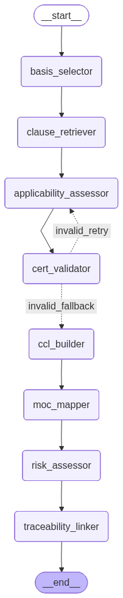
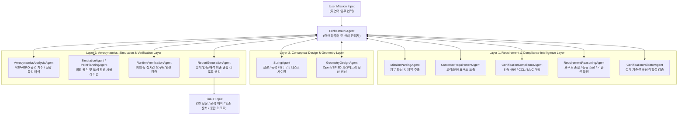
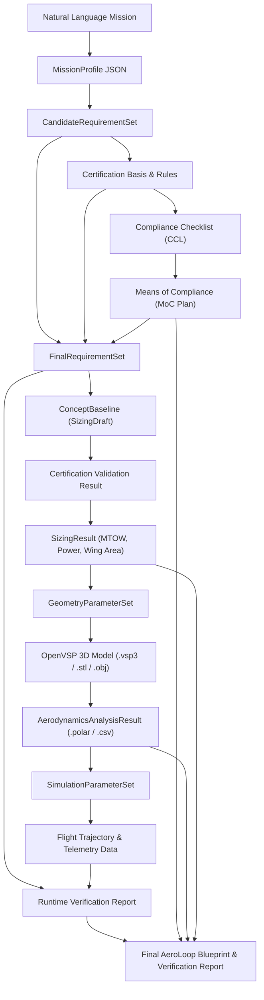

# AeroLoop: Autonomous Multi-Agent eVTOL / UAM Aircraft Conceptual Design & Verification Platform

<p align="center">
  
</p>

**AeroLoop**는 도심항공교통(UAM) 및 eVTOL 항공기의 개념 설계(Conceptual Design), 인증 규정 검토(Certification Compliance), 물리 해석(Aerodynamics & Sizing), 3D 형상 생성(OpenVSP CAD), 비행 시뮬레이션 및 실시간 요구도 검증(Runtime Verification) 전 과정을 유기적으로 통합·자동화하는 **엔지니어링 멀티 에이전트 플랫폼**입니다.

사용자의 자연어 임무 입력(Natural Language Mission Input)으로부터 시작하여, 요구도 분석 → 인증 규정/CCL/MoC 매핑 → 시스템 요구도 확정 → 기체 사이징 → 3D 파라메트릭 CAD 모델링 → 공력 및 질량 해석 → 비행 시뮬레이션 → 요구도 충족 검증 및 최종 리포트 출력까지의 전 주기를 **양방향 상태 그래프(Bidirectional LangGraph StateGraph)** 기반의 AI 에이전트 파이프라인으로 수행합니다.

---

## 📑 목차 (Table of Contents)

1. [핵심 특징 (Key Features)](#-핵심-특징-key-features)
2. [시스템 아키텍처 (System Architecture)](#-시스템-아키텍처-system-architecture)
   - [3-Layer 에이전트 아키텍처](#1-3-layer-에이전트-아키텍처)
   - [양방향 상태 그래프 워크플로우](#2-양방향-상태-그래프-워크플로우-bidirectional-workflow)
   - [에이전트 역할 및 책임 흐름](#3-에이전트-역할-및-책임-흐름)
   - [데이터 아티팩트 및 추적성 흐름](#4-데이터-아티팩트-및-추적성-흐름)
   - [에이전트 명세 목록](#5-에이전트-명세-목록)
3. [환경 설정 및 설치 (Installation)](#-환경-설정-및-설치-installation)
   - [기본 환경 구성](#1-기본-환경-구성)
   - [OpenVSP 및 VSPAERO 빌드/설정](#2-openvsp-및-vspaero-빌드설정)
   - [환경 변수 설정](#3-환경-변수-설정)
4. [Langfuse 프롬프트 관리 (Prompt Management)](#-langfuse-프롬프트-관리-prompt-management)
5. [CLI 사용 가이드 (`aero-run`)](#-cli-사용-가이드-aero-run)
   - [전체 워크플로우 실행 (`workflow`)](#1-전체-워크플로우-실행-workflow)
   - [Gradio 대시보드 실행 (`gui`)](#2-gradio-대시보드-실행-gui)
   - [단일 에이전트 단계별 실행](#3-단일-에이전트-단계별-실행)
6. [대화형 웹 데모 & 3D 뷰어 (Interactive UI)](#-대화형-웹-데모--3d-뷰어-interactive-ui)
7. [물리 해석 및 공학 엔진 (Engineering & Backends)](#-물리-해석-및-공학-엔진-engineering--backends)
   - [OpenVSP & VSPAERO 연동](#1-openvsp--vspaero-연동)
   - [SUAVE eVTOL 사이징 엔진](#2-suave-evtol-사이징-엔진)
8. [프로젝트 디렉토리 구조 (Directory Structure)](#-프로젝트-디렉토리-구조-directory-structure)
9. [에이전트 개발 규칙 (Development Rules)](#-에이전트-개발-규칙-development-rules)
10. [테스트 및 검증 (Testing)](#-테스트-및-검증-testing)

---

## 🌟 핵심 특징 (Key Features)

- **자연어 기반 임무 파싱 (Mission Parsing)**: 비행 거리, 승객 수, 고도 제한, 장애물 이격 거리 등 자연어로 기술된 임무로부터 공학적 수치 및 제약 조건을 자동 정규화.
- **인증 규정 인텔리전스 (Certification Compliance)**: EASA SC-VTOL, FAA Part 23/27/29, KAS 규정 데이터베이스를 바탕으로 적용 규정 선정, 규정 적합성 체크리스트(CCL), 적합성 입증 방법(MoC) 수립.
- **스키마 기반 추적성 (Schema-First & Evidence Traceability)**: 원문 문장(Evidence Span), 규정 조항(Regulation Clause), 설계 파라미터(Design Parameter) 간의 연결성을 `TraceabilityRegistry`로 보증.
- **양방향 피드백 루프 (Cyclic Feedback & HITL)**: 사이징 실패, 규정 위반, 공력 불일치 발생 시 Orchestrator가 이전 단계 에이전트(임무 파싱, 요구도 정제, 형상 수정)로 역전파하여 자동 수정하거나 사람의 개입(Human-in-the-Loop) 요청.
- **3D 파라메트릭 CAD 및 공력 해석 (OpenVSP / VSPAERO)**: Lift+Cruise, Multirotor, Vectored Thrust 등 다양한 eVTOL 형상을 파라메트릭 YAML 템플릿으로 실시간 3D 모델링하고, 양력 분포/항력 곡선/질량 특성을 해석.
- **다양한 인터페이스 제공**: 강력한 CLI 도구(`aero-run`), 실시간 추적 및 3D 시각화 Gradio 대시보드(`aero-run gui`), 자연어로 형상을 실시간 수정하는 Web Studio 데모 지원.

---

## 🏗️ 시스템 아키텍처 (System Architecture)

### 1. 3-Layer 에이전트 아키텍처

AeroLoop는 목적과 계층에 따라 3단계 레이어로 구분되어 운영됩니다.



---

### 2. 양방향 상태 그래프 워크플로우 (Bidirectional Workflow)

LangGraph 기반의 상태 그래프로 구성되어 있으며, 설계 조건 불만족이나 물리적 불일치가 탐지될 경우 이전 단계로 롤백 및 파라미터 보정을 수행합니다.

```mermaid
graph TD
    Start["START<br/>(Natural Language Mission)"] --> Orch["OrchestratorAgent"]

    Orch -->|"1. Parse Mission"| MPA["MissionParsingAgent"]
    MPA -->|"MissionProfile, Explicit Constraints, Missing Fields"| Orch

    Orch -->|"2. Extract Customer Reqs"| CRA["CustomerRequirementAgent"]
    CRA -->|"Candidate Requirements, Unresolved Questions"| Orch

    Orch -->|"3. Review Certification Basis"| CCA["CertificationComplianceAgent"]
    CCA -->|"Certification Basis, Applicable Rules, CCL/MoC Draft"| Orch

    Orch -->|"4. Resolve & Baseline Reqs"| RRA["RequirementReasoningAgent"]
    RRA -->|"FinalRequirementSet, ConceptBaseline (SizingDraft)"| Orch

    Orch -->|"5. Validate Baseline"| CVA["CertificationValidatorAgent"]
    CVA -->|"ValidationResult (is_valid, Violations/Warnings)"| Orch

    Orch -->|"6. Size Aircraft"| SA["SizingAgent"]
    SA -->|"SizingResult (MTOW, Battery, Disk Area, Wing Area)"| Orch

    Orch -->|"7. Generate Geometry"| GDA["GeometryDesignAgent"]
    GDA -->|"OpenVSP .vsp3, .stl, 3D Parameters"| Orch

    Orch -->|"8. Analyze Aerodynamics"| AAA["AerodynamicsAnalysisAgent"]
    AAA -->|"Aero Summary (dCl/dAlpha, Cd0, L/D), Mass Properties"| Orch

    Orch -->|"9. Simulate Mission"| SIM["SimulationAgent / PathPlanningAgent"]
    SIM -->|"Trajectory, Energy Consumption, Obstacle Clearance"| Orch

    Orch -->|"10. Runtime Verification"| RVA["RuntimeVerificationAgent"]
    RVA -->|"Pass/Fail Status, Violation Logs, Runtime Evidence"| Orch

    Orch -->|"11. Generate Final Report"| RGA["ReportGenerationAgent"]
    RGA --> End["END<br/>(Final Conceptual Design Blueprint)"]

    %% Feedback / Rollback Loops
    CRA -.->|"정보 누락 / 모호한 요구도"| RRA
    CVA -.->|"인증 규정 위반"| RRA
    SA -.->|"수렴 실패 / 물리적 사이징 불가"| RRA
    AAA -.->|"공력 계수 미달 / 불안정"| SA
    SIM -.->|"에너지 고갈 / 지오펜스 침범"| RRA
    RVA -.->|"Runtime 요구도 위반"| Orch
    Orch -.->|"반복 실패 시 임무 제약 완화 요청"| MPA
```



---

### 3. 에이전트 역할 및 책임 흐름


---

### 4. 데이터 아티팩트 및 추적성 흐름



---

### 5. 에이전트 명세 목록

각 에이전트의 상세 요구사항, 입출력 스키마, 추론 정책 및 테스트 케이스는 [`Agent-Requirements-Specification/`](Agent-Requirements-Specification/)에 정의되어 있습니다.

| ID | 에이전트 이름 | 주요 역할 및 책임 | 명세서 문서 |
|---|---|---|---|
| 00 | **OrchestratorAgent** | 전체 LangGraph 워크플로우 제어, 분기 판단 및 HITL 라우팅 | [`00. OrchestratorAgent.md`](Agent-Requirements-Specification/00.%20OrchestratorAgent.md) |
| 01 | **MissionParsingAgent** | 자연어 임무 텍스트를 구조화된 `MissionProfile`로 정규화 | [`01. MissionParsingAgent.md`](Agent-Requirements-Specification/01.%20MissionParsingAgent.md) |
| 02 | **CustomerRequirementAgent** | 고객 및 운용 관점의 기능/비기능 요구사항 추출 | [`02. CustomerRequirementAgent.md`](Agent-Requirements-Specification/02.%20CustomerRequirementAgent.md) |
| 03 | **CertificationComplianceAgent** | EASA SC-VTOL, FAA, KAS 기반 인증 기준선 및 CCL/MoC 수립 | [`03. CertificationComplianceAgent.md`](Agent-Requirements-Specification/03.%20CertificationComplianceAgent.md) |
| 04 | **RequirementReasoningAgent** | 요구도 충돌 해결, 가정 명시 및 초기 `ConceptBaseline` 생성 | [`06. RequirementReasoningAgent.md`](Agent-Requirements-Specification/06.%20RequirementReasoningAgent.md) |
| 05 | **CertificationValidatorAgent** | 생성된 `ConceptBaseline`의 인증 규정 위반 여부 검사 | [`07. CertificationValidatorAgent.md`](Agent-Requirements-Specification/07.%20CertificationValidatorAgent.md) |
| 06 | **SizingAgent** | 질량(MTOW), 에너지, 배터리, 로터/윙 면적 사이징 연산 | [`05. SizingAgent.md`](Agent-Requirements-Specification/05.%20SizingAgent.md) |
| 07 | **GeometryDesignAgent** | YAML 템플릿 기반 OpenVSP 3D 모델 및 STL 생성 | [`04. GeometryDesignAgent.md`](Agent-Requirements-Specification/04.%20GeometryDesignAgent.md) |
| 08 | **AerodynamicsAnalysisAgent** | VSPAERO 공력 해석, 양력 곡선 및 질량 특성 도출 | [`08. AerodynamicsAnalysisAgent.md`](Agent-Requirements-Specification/08.%20AerodynamicsAnalysisAgent.md) |

---

## 🛠️ 환경 설정 및 설치 (Installation)

### 1. 기본 환경 구성

AeroLoop는 Python 3.10 이상 환경을 권장하며, `aero` Conda 환경을 사용합니다.

```bash
# 1. 가상환경 활성화 (또는 생성)
conda activate aero

# 2. 패키지 편집 가능 모드 설치
pip install -e .

# 3. 개발용 추가 패키지 설치 (선택)
pip install -e ".[dev]"
```

### 2. OpenVSP 및 VSPAERO 빌드/설정

AeroLoop의 형상 모델링 및 공력 해석 기능을 구동하려면 OpenVSP 백엔드가 필요합니다.

```bash
# OpenVSP 자동 빌드 스크립트 실행
bash scripts/install_openvsp.sh
```

- **빌드 기본 경로**: `thirdparty/build_openvsp`
- **Python API 경로**: `thirdparty/build_openvsp/OpenVSP-prefix/src/OpenVSP-build/python_pseudo/openvsp`

> [!NOTE]
> `GeometryDesignAgent` 및 `AerodynamicsAnalysisAgent`는 환경 변수 `OPENVSP_PYTHON_PATH` 또는 기본 빌드 경로를 참조하여 자동으로 모듈을 로드합니다.

### 3. 환경 변수 설정

OpenAI LLM 및 Langfuse 연동을 위한 환경 변수를 설정합니다.

```bash
# OpenAI API 키
conda env config vars set OPENAI_API_KEY="sk-..."

# Langfuse 추적 및 프롬프트 관리 키 (선택 사항)
conda env config vars set LANGFUSE_PUBLIC_KEY="pk-lf-..."
conda env config vars set LANGFUSE_SECRET_KEY="sk-lf-..."
conda env config vars set LANGFUSE_HOST="https://cloud.langfuse.com"

# 환경 재활성화하여 변수 적용
conda deactivate && conda activate aero
```

---

## 📡 Langfuse 프롬프트 관리 (Prompt Management)

AeroLoop 에이전트는 프롬프트 버전 관리 및 모니터링을 위해 **Langfuse** 연동을 지원합니다.

```bash
# 프롬프트 등록 (기본 label: staging)
python scripts/register_prompts.py

# 실제 전송 없이 페이로드 사전 검증 (Dry-run)
python scripts/register_prompts.py --dry-run

# 프로덕션 배포 시 레이블 지정
python scripts/register_prompts.py --label production
```

**등록되는 에이전트 프롬프트 목록:**
- `aeroloop/mission-parsing-agent`
- `aeroloop/customer-requirement-agent`
- `aeroloop/certification-compliance/basis-selector`
- `aeroloop/certification-compliance/applicability-assessor`
- `aeroloop/certification-compliance/cert-validator`
- `aeroloop/certification-compliance/moc-mapper`
- `aeroloop/certification-compliance/risk-assessor`
- `aeroloop/certification-compliance/traceability-linker`

---

## 💻 CLI 사용 가이드 (`aero-run`)

`aero-run` CLI 명령어를 통해 전체 파이프라인 워크플로우, GUI 대시보드, 또는 각 단계별 에이전트를 독립적으로 실행할 수 있습니다.

### 1. 전체 워크플로우 실행 (`workflow`)

자연어 임무 설명이나 데모 요구도 파일을 입력받아 전체 워크플로우를 실행합니다.

```bash
# 1) 직접 자연어 임무 입력 (Human-in-the-loop 상호작용 포함)
aero-run workflow "건국대 캠퍼스 안에서 2명이 탑승하는 eVTOL을 기숙사에서 도서관까지 운항하고 싶다. 고도는 120m 이하로 유지하고, 건물과는 최소 10m 이상 떨어져야 한다."

# 2) 데모 파일(demo_requirements.md) 기반 실행
aero-run workflow demo

# 3) 사람의 개입 없이 AI 자동 추론으로 끝까지 실행 (--full-auto)
aero-run workflow demo --full-auto
```

실행 결과 아티팩트는 `results/<user_id>/<run_id>/`에 자동 저장됩니다:
- `mission_parsing_result.json`
- `customer_requirements_result.json`
- `certification_compliance_result.json`
- `requirement_reasoning_result.json`
- `System_Requirements_Report.md`
- `certification_validation_result.json`
- `sizing_result.json`
- `geometry_output/` (`.vsp3`, `.stl`, `.obj`)
- `aerodynamics_output/` (`.polar`, `load_distribution.csv`)

---

### 2. Gradio 대시보드 실행 (`gui`)

실시간 에이전트 이벤트 스트리밍, 대화형 HITL 질의응답, 3D 형상 시각화 및 공력 극곡선(Polar Curve) 차트를 지원하는 인터랙티브 UI를 구동합니다.

```bash
aero-run gui
```

- 웹 브라우저에서 `http://127.0.0.1:7860` 접속
- 자연어 임무 입력 후 워크플로우 구동 및 3D 모델 렌더링 확인

---

### 3. 단일 에이전트 단계별 실행

디버깅 및 모듈별 검증을 위해 각 에이전트를 단독으로 실행할 수 있습니다.

#### ① MissionParsingAgent (`mission`)
```bash
aero-run mission "건국대 캠퍼스 2인승 eVTOL 운항..."
```

#### ② CustomerRequirementAgent (`customer`)
```bash
aero-run customer results/default_user/RUN-XXX/mission_parsing_result.json
```

#### ③ CertificationComplianceAgent (`certification`)
```bash
aero-run certification results/default_user/RUN-XXX/customer_requirements_result.json
```

#### ④ RequirementReasoningAgent (`reasoning`)
```bash
aero-run reasoning results/default_user/RUN-XXX/customer_requirements_result.json
```

#### ⑤ CertificationValidatorAgent (`validator`)
```bash
aero-run validator results/default_user/RUN-XXX/requirement_reasoning_result.json
```

#### ⑥ SizingAgent (`sizing`)
```bash
aero-run sizing results/default_user/RUN-XXX/requirement_reasoning_result.json
```

#### ⑦ GeometryDesignAgent (`geometry`)
```bash
aero-run geometry results/default_user/RUN-XXX/sizing_result.json
```

#### ⑧ AerodynamicsAnalysisAgent (`aerodynamics`)
```bash
aero-run aerodynamics results/default_user/RUN-XXX/geometry_design_result.json
```

---

## 🌐 대화형 웹 데모 & 3D 뷰어 (Interactive UI)

AeroLoop는 웹 브라우저에서 자연어로 3D 형상을 실시간 편집하고 시각화할 수 있는 **Chat-to-Geometry 데모 서버**를 제공합니다.

```bash
# 데모 서버 실행
cd demo
uvicorn server:app --port 8080 --host 0.0.0.0
```

- **접속 주소**: `http://localhost:8080`
- **주요 기능**:
  - Three.js 기반 3D CAD(STL/OBJ) 실시간 렌더링
  - 대화형 자연어 프롬프트("날개 길이를 12m로 늘려줘", "Multirotor 템플릿으로 변경해줘")
  - 파라미터 슬라이더를 통한 직관적인 CAD 형상 튜닝

---

## ⚙️ 물리 해석 및 공학 엔진 (Engineering & Backends)

### 1. OpenVSP & VSPAERO 연동

AeroLoop는 파라메트릭 항공기 형상 생성 및 공력 해석을 위해 NASA의 **OpenVSP / VSPAERO**를 통합 활용합니다.

- **파라메트릭 템플릿**: [`src/aeroloop/design/openvsp_maximal_geometry_template.yaml`](src/aeroloop/design/openvsp_maximal_geometry_template.yaml)
- **템플릿 실행기**: [`src/aeroloop/design/openvsp_template_executor.py`](src/aeroloop/design/openvsp_template_executor.py)
- **공력 해석 파이프라인**:
  - `CompGeom`: 젖은 면적(Wetted Area), 익면적(Wing Area), 유효 종횡비(Aspect Ratio) 계산
  - `Parasite Drag Build-up`: 유해 항력 계수($C_{D,0}$) 및 형태 항력 추정
  - `VSPAERO (Vortex Lattice Solver)`: 받음각별 양력 곡선 기울기($dC_L/d\alpha$), 유도 항력, 날개 스팬별 하중 분포($C_l(y)$), 최대 양항비($(L/D)_{max}$) 산출
  - `Mass Properties`: 구조 중량 분포 및 무게중심(CG, $x, y, z$) 계산

### 2. SUAVE eVTOL 사이징 엔진

[`src/aeroloop/engineering/suave_evtol/`](src/aeroloop/engineering/suave_evtol/) 서브패키지는 임무 프로파일 기반의 전기동력 eVTOL 사이징 및 성능 해석을 지원합니다.

- 수직 이착륙(Hover), 천이 비행(Transition), 순항(Cruise) 구간별 소요 동력 및 에너지 소비량 모델링
- 배터리 팩 질량, 모터/인버터 중량 및 최대이륙중량(MTOW) 수렴 반복 연산
- 로터 디스크 부하(Disk Loading) 및 익면 부하(Wing Loading) 제약 조건 분석

---

## 📁 프로젝트 디렉토리 구조 (Directory Structure)

```text
AeroLoop/
├── Agent-Requirements-Specification/ # 에이전트별 상세 요구사항 명세서 (00~08)
├── configs/                          # 시스템, 모델 라우팅, 시뮬레이션 설정 파일
├── data/                             # 인증 규정 원문, 지오펜스 맵, 프리셋 데이터
├── demo/                             # Chat-to-Geometry 3D 웹 데모 애플리케이션
│   ├── server.py                     # FastAPI 백엔드
│   └── index.html                    # Three.js 3D 뷰어 프론트엔드
├── docs/                             # 시스템 설계 및 아키텍처 문서
├── notebooks/                        # 에이전트 및 해석 샌드박스 Jupyter Notebook
├── scripts/                          # OpenVSP 설치, 프롬프트 등록 등 자동화 스크립트
├── src/aeroloop/                     # 핵심 패키지 소스 코드
│   ├── agents/                       # AI 에이전트 구현부 (MissionParsing, Sizing, etc.)
│   ├── api/                          # REST API 엔드포인트 라우터
│   ├── certification/                # 규정 검색, CCL/MoC 빌더, 추적성 링커
│   ├── cli/                          # aero-run CLI 엔트리포인트 (run.py)
│   ├── design/                       # OpenVSP YAML 템플릿 및 파라메트릭 실행기
│   ├── engineering/                  # 사이징 엔진, SUAVE eVTOL 해석 모듈
│   ├── environment/                  # 3D 도심 맵, 시맨틱 그리드, 지오펜스
│   ├── gui/                          # Gradio 인터랙티브 대시보드
│   ├── llm/                          # LLM 어댑터, 팩토리, 프롬프트 공급자
│   ├── orchestration/                # LangGraph StateGraph 워크플로우 정의
│   ├── planning/                     # 전역/지역 3D 비행 경로 계획기
│   ├── reporting/                    # 설계 보고서 렌더러
│   ├── retrieval/                    # 규정 문서 임베딩 및 벡터 저장소
│   ├── schemas/                      # Pydantic 기반 표준 데이터 모델
│   ├── simulation/                   # 6-DOF 비행 동역학 및 시뮬레이터
│   ├── utils/                        # 공통 유틸리티 (단위 변환, 로깅, ID 생성)
│   └── verification/                 # 런타임 요구도 검증 및 위반 감지기
├── tests/                            # 단위 테스트, 에이전트 테스트, E2E 통합 테스트
├── thirdparty/                       # OpenVSP 서드파티 빌드 디렉토리
├── demo_requirements.md              # 건국대 캠퍼스 기준 데모 임무 요구도
└── pyproject.toml                    # 패키지 빌드 메타데이터 및 의존성 정의
```

---

## 📜 에이전트 개발 규칙 (Development Rules)

AeroLoop의 모든 에이전트 개발 및 개선은 [`.agents/rules/agent-dev-workflow.md`](.agents/rules/agent-dev-workflow.md)를 엄격히 준수합니다.

1. **명세서 우선 작성 (Spec-First)**: 코드 구현 전 반드시 [`Agent-Requirements-Specification/`](Agent-Requirements-Specification/) 하위에 명세서 문서를 작성하거나 갱신해야 합니다.
2. **엄격한 스키마 정의 (Schema-First)**: 모든 입출력 데이터는 `src/aeroloop/schemas/` 내의 Pydantic 모델로 사전 정의되어야 합니다.
3. **근거 및 추적성 필수 (Evidence & Traceability)**: 생성되는 모든 요구사항, 설계 수치, 규정 조항은 원문 근거(Evidence span), 신뢰도(Confidence), 추적 링크(`TraceLink`)를 포함해야 합니다.
4. **환각 방지 (Hallucination Prevention)**: 추론 불가능하거나 누락된 정보는 임의로 조작하지 않고 `missing_fields` 또는 `unresolved_questions`로 명시하여 사람이 확인할 수 있도록 합니다.
5. **프롬프트 버전 관리 (Prompt Registration)**: 모든 에이전트 프롬프트는 Langfuse에 등록되어 버전이 관리되어야 합니다.

---

## 🧪 테스트 및 검증 (Testing)

AeroLoop는 코드 품질과 신뢰성을 위해 포괄적인 `pytest` 테스트 스위트를 갖추고 있습니다.

```bash
# 전체 테스트 실행
conda run -n aero pytest

# 에이전트 단위 테스트 실행
conda run -n aero pytest tests/agents/

# OpenVSP 및 형상 관련 테스트 실행
conda run -n aero pytest tests/test_geometry_types.py

# 엔드투엔드 워크플로우 테스트 실행
conda run -n aero pytest tests/test_e2e_workflow.py
```

---

<p align="center">
  <b>AeroLoop</b> — Autonomous Multi-Agent Aerospace Engineering Environment
</p>
