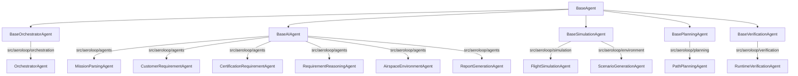

# AeroLoop Project Skeleton & Architecture Overview

본 문서는 AeroLoop 프로젝트의 디렉토리 스켈레톤, 파이프라인별 에이전트 상속 구조, 그리고 LLM 라우팅 관리를 위한 아키텍처를 요약합니다.

## 1. Directory Structure
AeroLoop는 모듈화된 계층형 아키텍처를 따르며, 핵심 비즈니스 로직과 데이터 관리, 시뮬레이션 환경이 분리되어 있습니다.

```text
AeroLoop/
├── .env.example                # OPENAI_API_KEY, LangSmith 등 환경 변수 템플릿
├── pyproject.toml              # 프로젝트 메타데이터 및 의존성 패키지 명세
├── README.md
├── configs/                    # 시스템 및 모델 라우팅 설정 파일
│   ├── model.yaml              # (New) 에이전트/파이프라인별 LLM 모델 매핑 
│   ├── app.yaml
│   ├── retrieval.yaml
│   ├── simulation.yaml
│   └── verification.yaml
├── data/                       # 시뮬레이션 및 데이터 소스
│   ├── aircraft_presets/       # 기종별 프리셋 데이터
│   ├── environments/           # 지오펜스, 시맨틱 맵 등 환경 데이터
│   ├── regulations/            # RAG를 위한 규정 원문 및 인덱스
│   ├── scenarios/              # 시나리오 파일 
│   └── outputs/                # 시뮬레이션/보고서 결과 출력 디렉토리
├── docs/                       # 문서
├── notebooks/                  # 프로토타이핑용 Jupyter 노트북
├── src/aeroloop/               # 핵심 패키지 소스 코드
│   ├── agents/                 # (Core) 에이전트 구현부 및 부모 클래스
│   ├── llm/                    # (New) LLM 어댑터 및 팩토리/라우터 모듈
│   ├── orchestration/          # 워크플로우 제어 및 상태 관리
│   ├── engineering/            # 공학 계산, 사이징 엔진
│   ├── environment/            # 시나리오 및 3D 맵 빌더
│   ├── planning/               # 전역/지역 경로 생성 
│   ├── simulation/             # 비행 동역학 및 시뮬레이터 구동
│   ├── verification/           # 실시간 요구도/안전 검증
│   ├── requirements/           # 요구도 정제 도구
│   ├── retrieval/              # RAG 기반 문서 검색 모듈
│   ├── reporting/              # 시각화 및 문서 렌더러
│   ├── schemas/                # Pydantic 기반 데이터 스키마
│   ├── api/                    # FastAPI 기반 외부 통신 인터페이스
│   └── utils/                  # 공통 유틸리티
└── tests/                      # 단위 테스트 및 E2E 테스트 코드
```

---

## 2. Agent Class Hierarchy & Pipeline
프로젝트 내의 에이전트는 역할과 파이프라인 성격에 따라 5개의 추상화된 베이스 클래스로 분류되며, 최상위 `BaseAgent`를 상속받습니다.



### Registered Agents (11 Agents)
1. **OrchestratorAgent**: 전체 시스템 제어, 하위 에이전트 라우팅 및 워크플로우 상태 관리.
2. **MissionParsingAgent**: 사용자의 자연어 임무를 엔지니어링 요구사항으로 분해.
3. **CustomerRequirementAgent**: 고객의 세부 요구와 운용 목적 분석.
4. **CertificationRequirementAgent**: KAS-VLA, SC-VTOL 등의 관련 규정에서 인증 요구사항 추출.
5. **RequirementReasoningAgent**: 병렬로 도출된 여러 요구사항을 통합하고 충돌을 조정하여 최종 설계 요구도로 정제.
6. **AirspaceEnvironmentAgent**: 복잡한 로컬 규정 RAG 탐색 및 환경 수용성(소음/바람) 판정.
7. **ReportGenerationAgent**: 최종 검토용(PDR/CDR) 보고서 자동 생성.
8. **FlightSimulationAgent**: 생성된 물리 엔진 바탕으로 3D 환경 내 비행 시뮬레이션 수행.
9. **ScenarioGenerationAgent**: 건국대 캠퍼스 등 특정 도심 블록을 대상으로 하는 환경/제한구역 시나리오 구성.
10. **PathPlanningAgent**: 3D Cost Map 기반으로 비행 궤적을 계획 및 실시간 재계획.
11. **RuntimeVerificationAgent**: 비행 중 발생하는 규정 위반, 고도 제한 및 소음 제한 등을 실시간으로 모니터링 및 로깅.

---

## 3. LLM Pipeline & Routing (`src/aeroloop/llm/`)
다양한 LLM 프로바이더(OpenAI, Anthropic, 오픈소스 로컬 모델 등)를 손쉽게 교체 및 확장하기 위해 팩토리 및 어댑터 패턴을 도입했습니다.

* `BaseLLMAdapter`: 모든 LLM 클라이언트가 지켜야 할 일관된 인터페이스를 제공.
* `OpenAIAdapter`: Langchain의 `ChatOpenAI`를 감싸 `gpt-4o-mini` 등을 실행할 수 있도록 하는 구현체.
* `LLMFactory`: `model.yaml`의 설정을 읽고, 상황에 맞는 어댑터를 런타임에 동적으로 주입(Inject)합니다.

**적용 사례 (`BaseAIAgent`):**
에이전트는 코드 내부에서 LLM을 강결합하지 않고, 생성 시 전달되는 설정값(`model_config`)을 통해 유연하게 모델을 사용할 수 있습니다. 이를 통해 간단한 텍스트 파싱은 `gpt-4o-mini`에, 정교한 보고서 생성은 더 큰 파라미터를 가진 모델에 맡기는 방식의 개별 라우팅이 가능해집니다.
